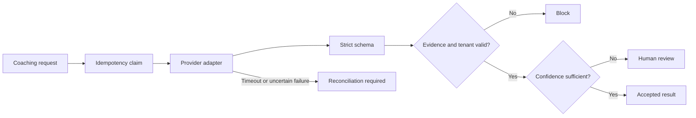

# Bizware AI architecture validation sample

Most AI integration diagrams look fine until the first retry, malformed model response, or tenant mismatch. This repository is a small executable example of how I validate those boundaries before an MVP build.

It is an independent work sample. It is not Bizware AI production code, contains no client data, and does not claim access to Bizware's private architecture.

## What the sample covers

- A provider-neutral interface for an LLM-backed coaching step
- Strict request and response schemas
- Evidence allowlisting and tenant-boundary checks
- Confidence-based human review instead of guessed output
- Deterministic idempotency keys
- Durable `claimed`, `completed`, and `reconciliation_required` states
- Eleven tests covering retries, duplicates, malformed data, unsupported evidence, and provider failure

The sample deliberately stops after validation. It does not send messages, update a CRM, or take another external action.

## Flow



## Run it

```bash
python -m venv .venv
python -m pip install -e ".[dev]"
pytest
```

The tests use a deterministic stub provider, so no API key or network access is required.

## Why these checks come before an MVP

A successful API call proves very little on its own. Architecture validation should also answer:

1. Can a response be parsed without quietly accepting extra or missing fields?
2. Can the output cite only evidence that belongs to the current tenant and request?
3. Does uncertain output stop for human review?
4. Can a retry distinguish between "nothing happened" and "the action may have happened"?
5. Can the provider be replaced without rewriting the business rules?

The accompanying documents turn those questions into a [validation plan](docs/validation-plan.md) and a short [risk register](docs/risk-register.md).

## Repository boundary

This is a reference implementation for architecture discussion. A production build would still need the selected provider SDK, authentication, encrypted persistence, observability, deployment controls, and tests against representative private data.

Please keep any project communication on Upwork until a contract is in place.
