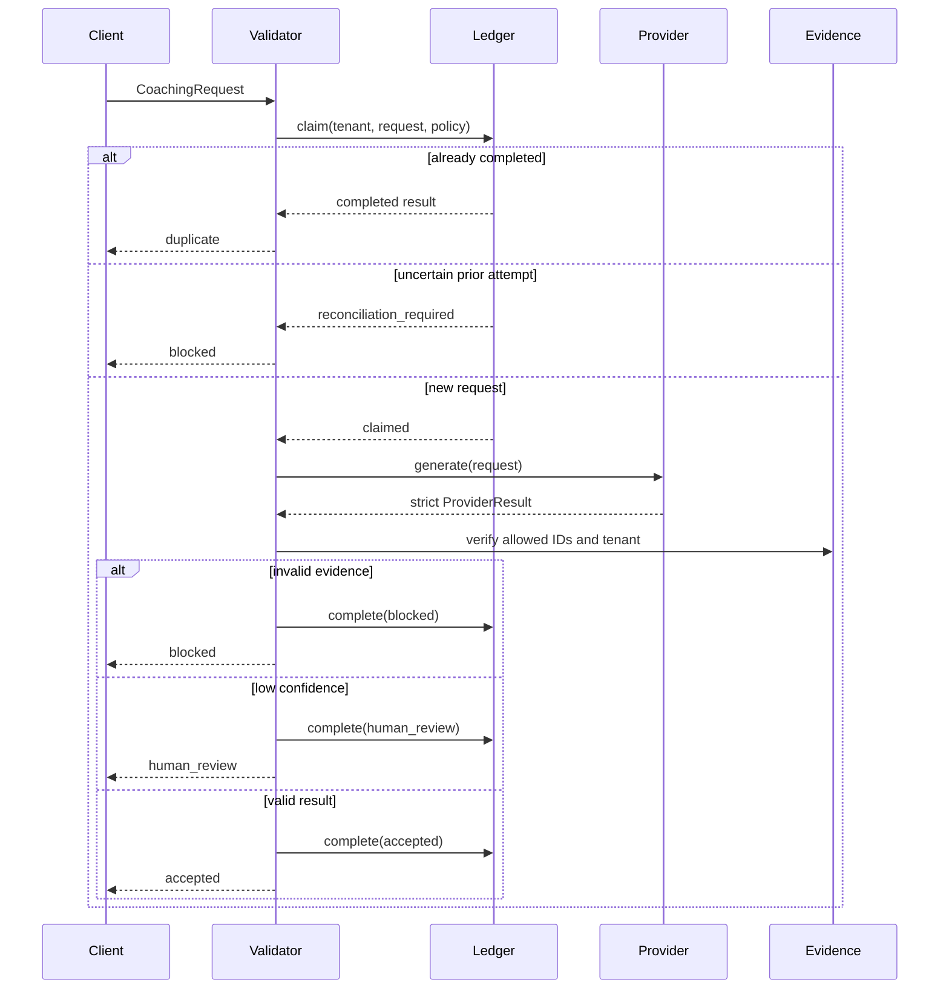

# Architecture note

The sample keeps model-provider code separate from business validation. A provider swap should change the adapter, not the evidence, confidence, tenancy, or idempotency rules.

## Production substitutions

| Sample component | Production concern |
| --- | --- |
| `StubProvider` | Selected provider SDK, timeout budget, model and prompt version |
| `InMemoryLedger` | Transactional database, leases, retention and audit access |
| `EvidenceStore` | Authorised retrieval layer with tenant-scoped queries |
| Pydantic schemas | Versioned API contracts and compatibility tests |
| Return value only | Explicit downstream action with its own idempotency boundary |
